# SafeSwim NZ TAK Iconset

A custom TAK iconset for [Safeswim](https://safeswim.org.nz) beach water
quality and lifeguard patrol status, used by the `etl-safeswim` ETL to
render composite status icons on TAK clients (ATAK, WinTAK, CloudTAK).

Each icon is a compact, non-square PNG combining a coloured water-quality
circle with an optional lifeguard/hazard overlay badge, matching the visual
language used on the Safeswim website map.

## Icons Included

36 icons across three display modes, organised in `source/Safeswim/`.

### Combined mode (water quality + patrol/safety, 24 icons)

| Icon | Filename | Description |
|------|----------|--------------|
|  | `SW.Green.png` | Good water quality |
| 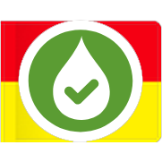 | `SW.Green.Lifeguarded.png` | Good water quality, lifeguards on duty |
| 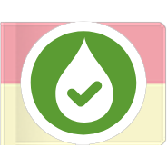 | `SW.Green.LifeguardedOff.png` | Good water quality, lifeguards off duty |
| 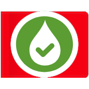 | `SW.Green.Warning.png` | Good water quality, safety warning |
| 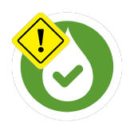 | `SW.Green.Hazard.png` | Good water quality, hazard flagged |
| 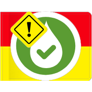 | `SW.Green.Lifeguarded.Hazard.png` | Good water quality, lifeguards on duty, hazard flagged |
| 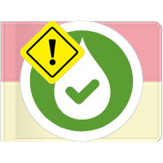 | `SW.Green.LifeguardedOff.Hazard.png` | Good water quality, lifeguards off duty, hazard flagged |
| 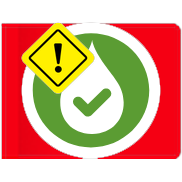 | `SW.Green.Warning.Hazard.png` | Good water quality, safety warning, hazard flagged |
|  | `SW.Red.png` | Swimming not advised |
|  | `SW.Red.Lifeguarded.png` | Swimming not advised, lifeguards on duty |
|  | `SW.Red.LifeguardedOff.png` | Swimming not advised, lifeguards off duty |
|  | `SW.Red.Warning.png` | Swimming not advised, safety warning |
| 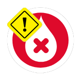 | `SW.Red.Hazard.png` | Swimming not advised, hazard flagged |
| 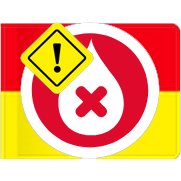 | `SW.Red.Lifeguarded.Hazard.png` | Swimming not advised, lifeguards on duty, hazard flagged |
| 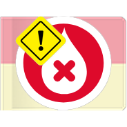 | `SW.Red.LifeguardedOff.Hazard.png` | Swimming not advised, lifeguards off duty, hazard flagged |
| 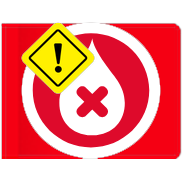 | `SW.Red.Warning.Hazard.png` | Swimming not advised, safety warning, hazard flagged |
| 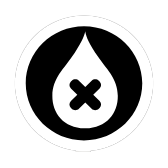 | `SW.Black.png` | Do not swim (wastewater overflow) |
| 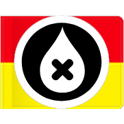 | `SW.Black.Lifeguarded.png` | Do not swim, lifeguards on duty |
| 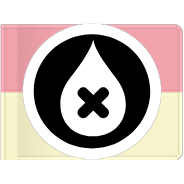 | `SW.Black.LifeguardedOff.png` | Do not swim, lifeguards off duty |
| 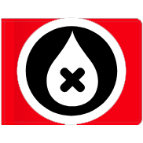 | `SW.Black.Warning.png` | Do not swim, safety warning |
|  | `SW.Black.Hazard.png` | Do not swim, hazard flagged |
| 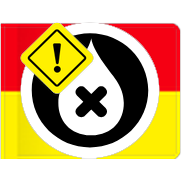 | `SW.Black.Lifeguarded.Hazard.png` | Do not swim, lifeguards on duty, hazard flagged |
| 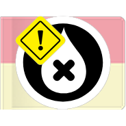 | `SW.Black.LifeguardedOff.Hazard.png` | Do not swim, lifeguards off duty, hazard flagged |
| 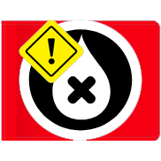 | `SW.Black.Warning.Hazard.png` | Do not swim, safety warning, hazard flagged |

### Quality-only mode (plain circles, 6 icons)

| Icon | Filename | Description |
|------|----------|--------------|
|  | `SW.Quality.Green.png` | Good water quality |
|  | `SW.Quality.Red.png` | Swimming not advised |
|  | `SW.Quality.Black.png` | Do not swim |
|  | `SW.Quality.Green.Hazard.png` | Good water quality, hazard flagged |
|  | `SW.Quality.Red.Hazard.png` | Swimming not advised, hazard flagged |
| 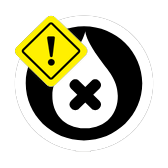 | `SW.Quality.Black.Hazard.png` | Do not swim, hazard flagged |

### Patrol-only mode (lifeguard flag badges, 6 icons)

| Icon | Filename | Description |
|------|----------|--------------|
|  | `SW.Patrol.OnDuty.png` | Lifeguards on duty |
|  | `SW.Patrol.OffDuty.png` | Lifeguards off duty |
|  | `SW.Patrol.None.png` | Not lifeguarded |
| 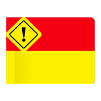 | `SW.Patrol.OnDuty.Hazard.png` | Lifeguards on duty, hazard flagged |
| 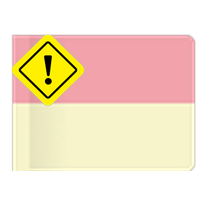 | `SW.Patrol.OffDuty.Hazard.png` | Lifeguards off duty, hazard flagged |
| 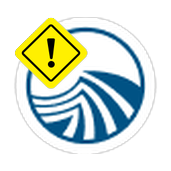 | `SW.Patrol.None.Hazard.png` | Not lifeguarded, hazard flagged |

### Overview

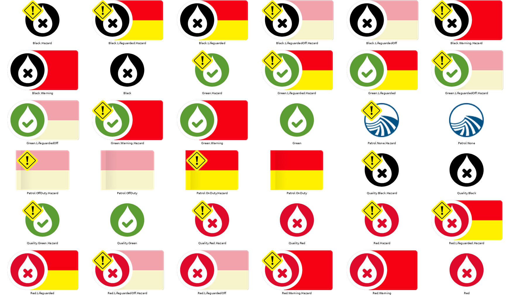

## Reference Icons

The `reference-icons/` folder contains the original pin PNGs downloaded from
the Safeswim website (`https://safeswim.org.nz/images/pins/`). These are the
source images `generate-icons.py` composites to produce the icons in
`source/Safeswim/`.

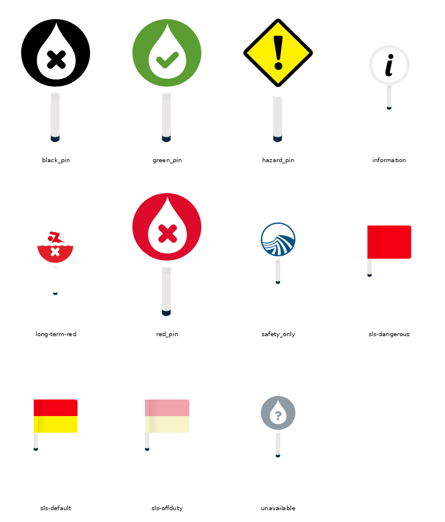

| Reference file | Safeswim meaning | Used for |
|---------------|------------------|----------|
| `green_pin.png` | Good water quality | Base for `SW.Green.*` |
| `red_pin.png` | Swimming not advised | Base for `SW.Red.*` |
| `black_pin.png` | Do not swim (overflow) | Base for `SW.Black.*` |
| `sls-default.png` | Lifeguards on duty | Overlay for `*.Lifeguarded` / `SW.Patrol.OnDuty` |
| `sls-offduty.png` | Lifeguards off duty | Overlay for `*.LifeguardedOff` / `SW.Patrol.OffDuty` |
| `sls-dangerous.png` | Dangerous conditions | Overlay for `*.Warning` |
| `hazard_pin.png` | Safety hazard warning | Reference (full pin) |
| `unavailable.png` | Data not available | Not used |
| `long-term-red.png` | Consistently poor quality | Not used |
| `safety_only.png` | Water safety info only | Standalone for `SW.Patrol.None` |
| `information.png` | Information note | Not used |

## Regenerating the Icons

If the icons need to be regenerated (e.g. after Safeswim updates their pin
designs):

```bash
pip install Pillow numpy
python3 generate-icons.py  # composites reference-icons/ -> source/Safeswim/
```

Requires `rsvg-convert` (from `librsvg2-bin`) to render the warning diamond
overlay.

## Building the TAK Data Package

```bash
./scripts/create_TAKDataPackage.sh
```

This generates `SafeSwimNZ-Package.zip`, which can be distributed to ATAK
devices via device profiles or imported manually into ATAK/CloudTAK as an
iconset.

## Installation

1. Download the latest release package (or build it as above).
2. Import the `.zip` file into your TAK application.
3. The SafeSwim NZ icons will be available in the iconset selection.

## Usage in TAK

Once installed, reference these icons using the format
`{iconset-uid}:Safeswim/{filename}`:

```
c2ec216e-9bfc-461d-b77a-e2099ffa9fa7:Safeswim/SW.Green.Lifeguarded.png
```

See [`../SPEC.md`](../SPEC.md) for the full icon selection logic used by the
`etl-safeswim` ETL.

## Structure

- `source/` - Contains `iconset.xml` and the generated icon PNGs (`Safeswim/`)
- `reference-icons/` - Original Safeswim pin/badge PNGs used to generate the icon set
- `generate-icons.py` - Script that composites `reference-icons/` into `source/Safeswim/`
- `datapackage/` - TAK mission package structure
- `scripts/` - Build automation scripts
- `Overview/` - Preview spritesheets of the generated icons and reference icons

## License

AGPL-3.0-only. See [`LICENSE`](LICENSE).
